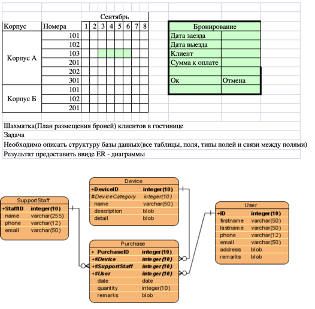
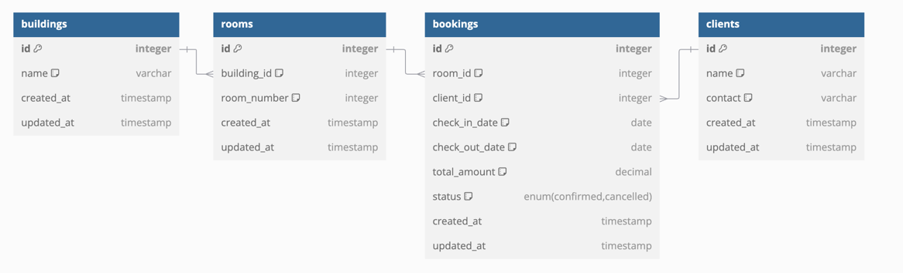

# Тестовое задание
#### На должность PHP Developer

---

Шахматка(План размещения броней) клиентов в гостинице
Задача
Необходимо описать структуру базы данных(все таблицы, поля, типы полей и связи между полями)
Результат предоставить ввиде ER - диаграммы

Корпус, Номера, Записи

---
### Функционал для создания брони 

[routes.php](routes.php)  - маршруты

[BookingRequest.php](BookingRequest.php) - Request Validation

[BookingService.php](BookingService.php) - Сервис создания записи

[BookingController.php](BookingController.php)- главный код контроллера

---

### База данных

